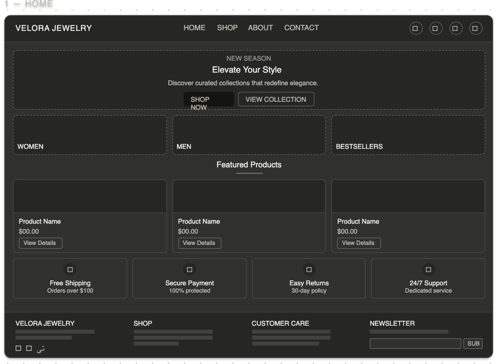
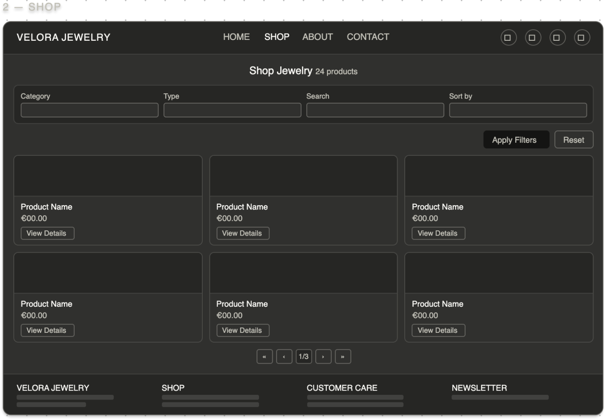
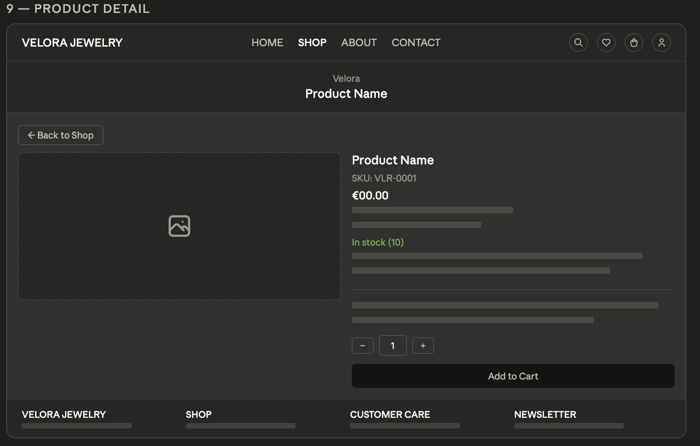
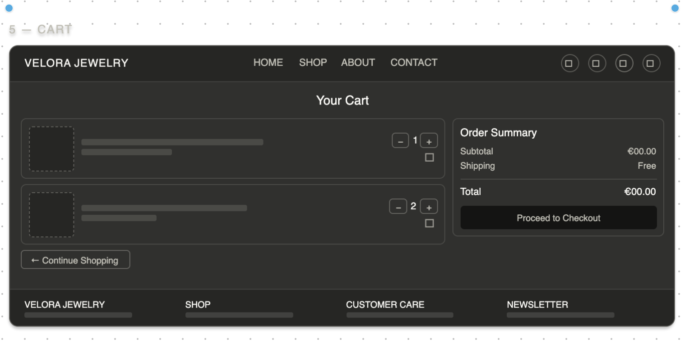
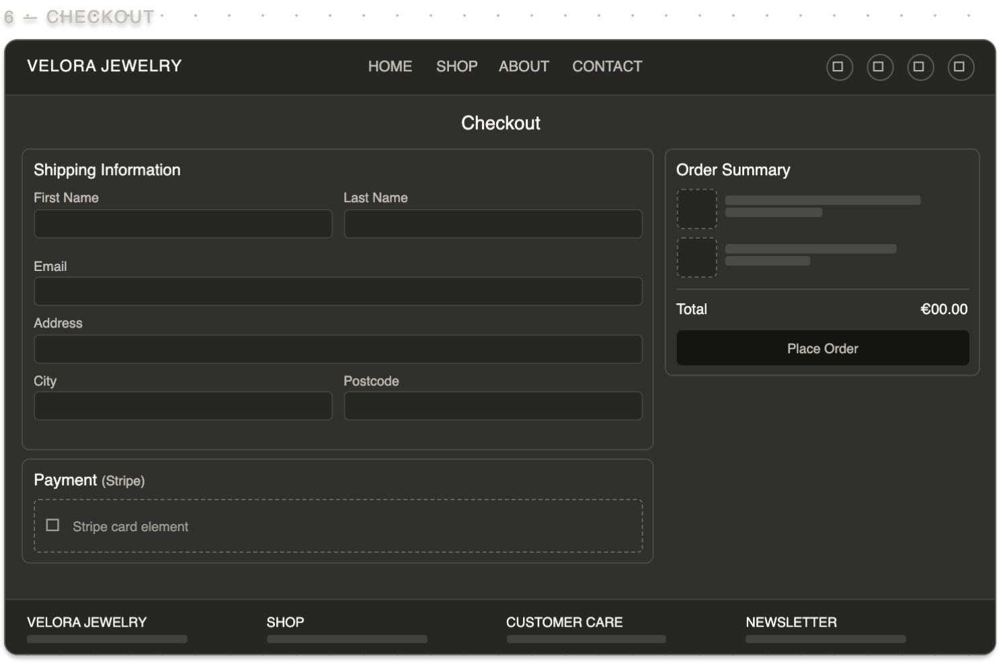
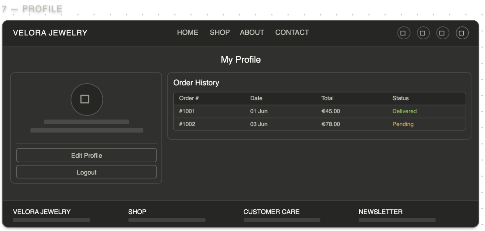
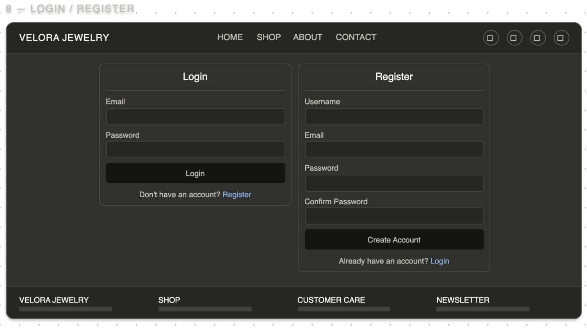
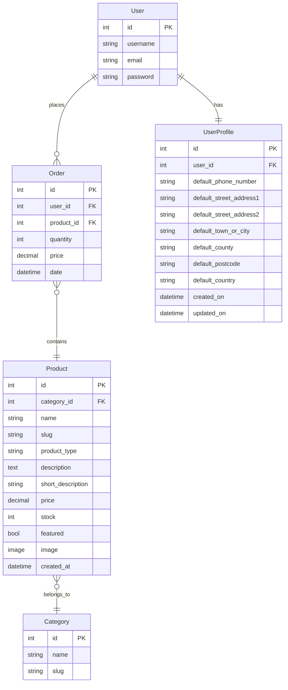
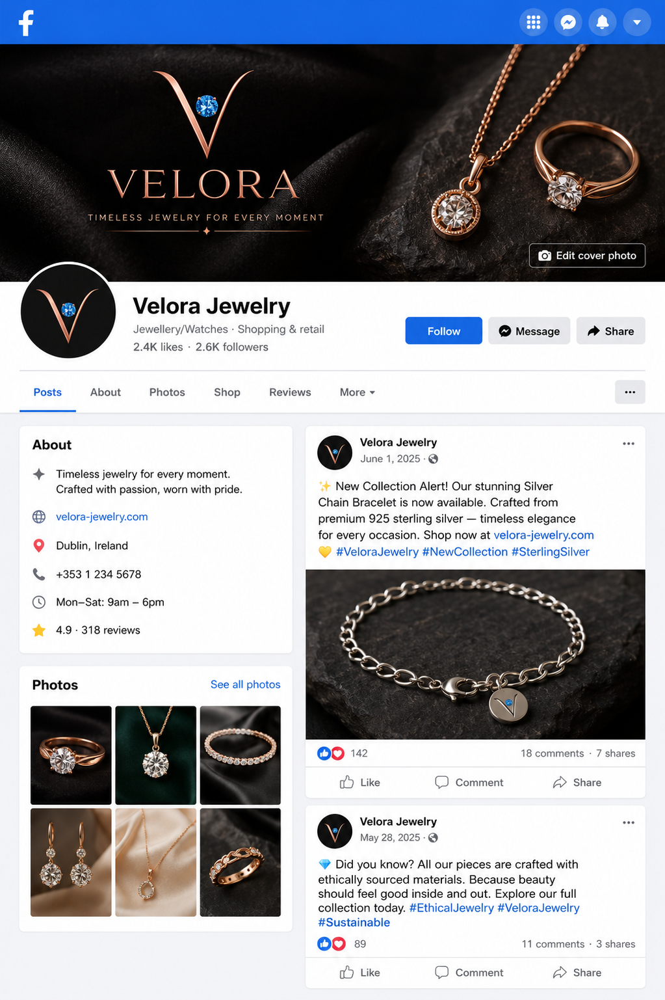

# Velora Jewelry

1. Project Overview
2. UX & User Stories
3. Design & Wireframes
4. Database Schema
5. Features
6. E-commerce & Payments
7. SEO
8. Marketing
9. Security Features
10. Technologies Used
11. Testing
12. Deployment
13. Credits

## 1. Project Overview
A full-stack Django e-commerce application for purchasing jewelry products.

### Business Model
Velora Jewelry operates under a Business-to-Consumer (B2C) e-commerce model.
The platform allows customers to browse and purchase jewelry products directly through a secure online checkout system.

**Revenue Model**
- Single-payment transactions via Stripe
- Direct online product sales
- No subscription model currently implemented

**Value Proposition**
- Affordable, stylish, and modern jewelry
- Secure and streamlined checkout process
- Easy account management and order tracking

**Growth Strategy**
Future expansion may include:
- Limited-edition collections
- Email marketing campaigns
- Social media promotions
- Potential subscription-based VIP offers

### Business Goals
- Sell handcrafted jewelry products online (B2C model)
- Provide a seamless and secure checkout experience
- Build brand visibility through SEO and social media marketing
- Collect customer emails for future promotions and product launches

## 2. UX & User Stories

## User Stories

### Authentication & User Accounts

    As a user, I want to register an account so that I can purchase jewelry products.

#### Acceptance Criteria
- The registration form includes: first name, last name, email, phone number, password, and password confirmation.
- Email input must be validated for correct __format validation.__
- Password must be at least __8 characters__ long.
- Password confirmation must match the original password.
- Clear __validation error messages__ are displayed for invalid input.
- After successful registration, the user is automatically __authenticated and logged in.__
- The navigation bar reflects the user's __authentication status.__

    As a user, I want to log in and log out so that my account remains secure.

#### Acceptance Criteria
- The login form includes __email and password fields.__
- Only registered users with valid credentials can log in.
- Invalid credentials display a clear __error message.__
- A logout option is visible only to __authenticated users.__
- After logout, the user is redirected to the __home page.__
- The navigation bar correctly reflects the user's __authentication status__ on all pages.
- __Restricted pages require authentication__ and redirect unauthenticated users to the login page.

    As a logged-in user, I want to see my login status so that I know I am authenticated.

#### Acceptance Criteria
- The logged-in user's username or email is displayed on all pages.
- The navigation menu updates dynamically based on login state (e.g., “Login/Register” → “Logout/Profile”).
- Unauthorized users cannot access __user-specific content.__
- Login status updates immediately after login or logout without requiring a page refresh.
- Any changes in authentication state (login/logout) are reflected consistently across all __templates.__

    As a logged-in user, I want to view my profile so that I can see my purchase history.

#### Acceptance Criteria
- The profile page displays all relevant user information: first name, last name, email, and phone number.
- A list of past purchases is displayed with __order details__ including product name, quantity, price, and purchase date.
- Users can update their contact information; __validation__ ensures correct format for email and phone number.
- Only __authenticated users__ can access the profile page; unauthorized users are redirected to the login page.
- Navigation links dynamically reflect login state and allow easy access to the profile page.
- Any updates made to the profile are saved to the __database__ and reflected immediately in the user interface.

### Product Browsing
    
    As a user, I want to browse available jewelry products so that I can choose items to buy.

#### Acceptance Criteria
- The main shop page lists all available products clearly.
- Each product displays a name, price, image, and short description.
- Products can optionally be filtered or sorted by category, type, or price.
- Clicking on a product navigates to a __detailed product page__ showing full description, images, and stock availability.
- The layout is __responsive__ and user-friendly across devices (desktop, tablet, mobile).
- Navigation allows users to easily return to the main shop page from product detail pages.

    As a user, I want to view detailed information about a product so that I can make an informed purchasing decision.

#### Acceptance Criteria
- The product detail page displays the product name, full description, price, and images.
- Optional attributes such as stock availability, SKU, size, or material are shown if available.
- An __“Add to Cart”__ button is present, even if the checkout system is not yet implemented.
- Navigation allows users to return to the main product list easily.
- Product images are displayed in a user-friendly gallery or slider if multiple images exist.
- Page layout is responsive and maintains readability on desktop, tablet, and mobile devices.

### Product Management (Admin)

    As an admin, I want to add new products so that I can sell jewelry items.

#### Acceptance Criteria
- Access to the __“Add Product”__ page is restricted to admin users only.
- The product creation form includes the following fields: product name, full description, price, image upload, category/type, stock quantity, and optional SKU.
- Validation ensures all required fields are completed and that price is a positive number.
- Clear success messages are displayed after a product is successfully added.
- Clear error messages are displayed for invalid input or missing required fields.
- After adding a product, the admin is redirected to the product list or detail page for confirmation.
- Uploaded product images are properly stored and displayed in the admin and shop views.

    As an admin, I want to edit product details so that I can keep product information up to date.

#### Acceptance Criteria
- Only admin users have access to the __“Edit Product”__ page.
- Admin can update product information including name, full description, price, category/type, stock quantity, SKU, and images.
- Validation is applied to all updated fields (e.g., price must be a positive number, required fields cannot be blank).
- Successful updates display a clear success message; errors display descriptive messages.
- After editing, changes are immediately reflected in the product detail page and shop listings.
- If images are updated, the new images are stored and displayed correctly, replacing the previous ones if necessary.
    
    As an admin, I want to delete products so that I can remove unavailable items.

#### Acceptance Criteria
- Only admin users can access the __“Delete Product”__ functionality.
- Attempting to delete a product triggers a __confirmation prompt__ to prevent accidental deletions.
- Once confirmed, the product is removed from the database and __immediately disappears__ from shop listings and product detail pages.
- Deleting a product also removes associated images from storage, if applicable.
- Success or error messages are displayed to confirm the outcome of the deletion.
- The system prevents deletion if the product is part of a pending order and notifies the admin appropriately.

### Checkout & Payments

    As a logged-in user, I want to securely pay for a product so that I can complete my purchase.

#### Acceptance Criteria
- The checkout page displays a secure payment form integrated with Stripe.
- Payment amount is automatically calculated from the products in the cart and cannot be altered by the user.
- Payment data is transmitted securely over HTTPS and encrypted in compliance with Stripe standards.
- Users cannot bypass the payment process to gain access to products or order confirmation.
- Upon successful payment, the user receives a clear confirmation message and order summary.
- Failed payment attempts display a descriptive error message and allow retrying.
- The system creates an order record in the database only after a successful payment transaction.
- Payment status is reflected in the user’s profile / purchase history immediately after completion.

    As a user, I want to receive confirmation when my payment is successful so that I know my order has been placed.

#### Acceptance Criteria
- After a successful payment, a clear success message is displayed on the checkout page.
- An __email confirmation__ is sent to the user with order details (optional but recommended).
- The order status in the database is updated to “Paid” or equivalent.
- Users are redirected to a __detailed order summary page__ showing purchased items, quantities, total price, and order date.
- The order summary page is linked from the user’s profile / purchase history for easy reference.
- Payment confirmation is secure and cannot be faked by manipulating URLs or browser behavior.

    As a user, I want to receive a clear error message if my payment fails so that I can try again.

#### Acceptance Criteria
- A descriptive error message is displayed to the user when a payment fails.
- No order record is created in the database for failed payments.
- Users can retry the payment for the same cart without losing their items.
- All failed payment attempts are logged in the system for admin review.
- Error messages clearly indicate the reason for failure when possible (e.g., card declined, network error, invalid details).
- Users are guided to corrective actions (e.g., retry, use another card, or contact support).
- The system prevents duplicate charges if the retry is attempted.

### Security & Access Control

    As a user, I want to be prevented from accessing restricted pages so that my data remains secure.

#### Acceptance Criteria
- Non-authenticated users are __redirected to the login page__ when trying to access protected pages.
- Users cannot access or view __other users’ data__, including profiles, orders, or cart contents.
- Access permissions are __enforced on the server side__, not just via frontend navigation.
- Attempts to access restricted pages are logged for security review.
- Protected pages show an appropriate message or redirect notice when access is denied.
- Admin-only pages are completely restricted to admin users; unauthorized access attempts redirect or block users.

    As an admin, I want to have access to administrative functionality so that I can manage the store.

#### Acceptance Criteria
- Access to all __admin functionality__ (add/edit/delete products, manage orders, view reports) is restricted to authenticated admin users.
- Non-admin users attempting to access admin pages are redirected or shown an __access denied message.__
- Admin login is required; session handling ensures secure authentication.
- All admin actions (add/edit/delete product, update orders) are __logged__ for auditing purposes.
- Navigation and UI elements for admin functionality are visible __only to admin users.__
- The system enforces __server-side checks__ to prevent unauthorized access even if frontend links are manipulated.

### UX & Feedback

    As a user, I want clear navigation so that I can easily find products and pages.

#### Acceptance Criteria
- __Main navigation__ is visible on all pages.
- Navigation includes links to __Home, Shop, Cart__, and __Profile/Login.__
- The __active page__ is visually indicated to help users know their location.
- Navigation is fully functional and __responsive__ on both __desktop__ and __mobile devices.__
- Users can easily return to the __home page__ from any page.
- Dropdowns, if any, are accessible and usable via keyboard for __accessibility.__

    As a user, I want to receive meaningful feedback messages so that I understand the result of my actions.

#### Acceptance Criteria
- __Success messages__ are displayed after key actions such as __login, purchase__, or __form submission.__
- __Error messages__ are displayed for invalid actions, form errors, or failed processes.
- All messages are __clear, user-friendly__, and convey the exact outcome.
- Messages can be __dismissed__ by the user or automatically disappear after a reasonable time.
- Messages are consistent in __style and placement__ across the site for easy recognition.
- Feedback is provided for both __frontend validation__ and __server-side errors__ to prevent confusion.


    As a user, I want to be redirected to a helpful page if I attempt to access a non-existent URL.

#### Acceptance Criteria
- A __custom 404 error page__ is displayed when a user accesses an invalid URL.
- The 404 page includes clear navigation options to __Home__ and __Shop.__
- The user is not shown a default __server error page.__
- The 404 page maintains the site's __consistent design and branding.__
- A friendly message explains that the page cannot be found.
- The error is handled gracefully without crashing the application.

### SEO & Marketing

    As a site owner, I want the site to be search-engine optimised so that more users can find it online.

#### Acceptance Criteria
- Each page includes a unique and descriptive __page title__ relevant to its content.
- All pages contain meaningful __meta descriptions__ to improve search visibility.
- A valid __sitemap.xml__ file is generated and submitted for indexing.
- A properly configured __robots.txt__ file is implemented.
- No placeholder text (e.g., __Lorem Ipsum__) is present in the final project.
- Images include descriptive __alt attributes__ for accessibility and SEO.
- Semantic HTML elements (e.g., <header>, <main>, <section>, <footer>) are used appropriately.
- URL structures are clean, readable, and SEO-friendly.

    As a user, I want to sign up for a newsletter so that I can receive updates and promotions.

#### Acceptance Criteria
- A __newsletter signup form__ is available on relevant pages (e.g., footer or homepage).
- Email input includes proper __validation__ (correct format, no empty submission).
- Duplicate email entries are prevented.
- A clear __confirmation message__ is displayed after successful signup.
- The email address is stored securely in the __database.__
- Newsletter data handling complies with __data protection principles__ (e.g., consent).

    As a site owner, I want to promote my products through a Facebook Business Page so that I can increase brand awareness.

#### Acceptance Criteria
- A __Facebook Business Page__ is created for the brand.
- The page includes the __brand name__, logo, and clear business description.
- Sample __product posts or promotional content__ are published.
- A screenshot or mockup of the page is included in the __README documentation.__
- A link to the Facebook page is included in the website footer.

## 3. Design & Wireframes

## Design & Wireframes

Wireframes were created prior to development to plan the layout and structure of each page.
They were designed using Claude AI and reflect the intended user interface for both desktop and mobile views.

| Page | Wireframe |
|---|---|
| Home |  |
| Shop |  |
| Product Detail |  |
| Cart |  |
| Checkout |  |
| Profile |  |
| Login and Register |  |

## 4. Database Schema

The application uses a **relational database** to support authentication, product management, and secure order processing.

The database will include the following core models:

- **User** (Django authentication model)
- **UserProfile**
- **Category**
- **Product**
- **Order**
- **OrderItem**
- **Newsletter** (optional feature)

All relationships will be enforced using **foreign key constraints** and follow relational database best practices.

A detailed schema description and Entity Relationship Diagram (ERD);



**Note:** The cart is session-based and does not require a database model. Cart data is stored in Django's session framework.

## 5. Features

- Product Browsing – Users can browse the full jewelry catalogue, view products details, images, descriptions, and pricing information.
- Shopping cart – Users can add products to their cart, adjust quantities, remove items, and view an automatically updated order summary before checkout.
- Stripe checkout – Secure payment processingis provided through Stripe integration, allowing users to complete purchases safely.
- Authentication – User can register, log in, and log out securely. Authentication-protected features are restricted to authorized users.
- Product Search and Filtering – Users can search for products and filter results to quickly find items that match their preferences.
- Order Confirmation – Users receive confirmation after a successful purchase, ensuring clear feedback on completed transactions.
- Featured Products Carousel – Selected products are highlighted on the homepage through a dynamic carousel to showcase featured items and promotions.
- Responsive Design – The application is designed to provide a consistent user experience across desktop, tablet, and mobile devices.

### Admin Product Management (CRUD)

Administrators can manage products using the Django admin panel, including creating, updating, viewing, and deleting products.

Staff users can also access a frontend “Add Product” interface to create new products directly from the website. Frontend add product is restricted to staff users only.

Access to admin functionality is restricted using Django authentication:

- `@staff_member_required` is used to protect admin-only views.
- `is_staff` is used to separate admin users from regular authenticated users.
- `user.is_authenticated` ensures only logged-in users can access protected features.

## 6. E-commerce & Payments

## 7. SEO

SEO was a core focus of this project. The following techniques were implemented to improve discoverability and search engine ranking.

### `sitemap.xml`

A dynamic XML sitemap is generated using Django's built-in `django.contrib.sitemaps` framework. It includes all product detail pages, category listing pages, and static pages (Home, About, Contact).

The sitemap is accessible at `/sitemap.xml`.

📄 View implementation: [`shop/sitemaps.py`](shop/sitemaps.py) · [`velora_jewelry/urls.py`](core/urls.py)

**Live Sitemap:**  
https://velora-jewelry-3258e9b85555.herokuapp.com/sitemap.xml

### `robots.txt`

A `robots.txt` file is served from the root URL to guide web crawlers. It allows indexing of public pages and disallows crawling of sensitive areas.

📄 View file: [`robots.txt`](templates/robots.txt)

Sitemap: https://velora-jewelry-3258e9b85555.herokuapp.com/sitemap.xml

### Meta Tags (Title & Description)

Every page includes a unique `<title>` and `<meta name="description">` tag, defined in the base template and overridden per page using Django template blocks.

📄 View implementation: [`templates/base.html`](templates/base.html) · [`shop/templates/shop/product_detail.html`](shop/templates/shop/product_detail.html)

### Open Graph Tags

Open Graph tags are implemented to improve how pages appear when shared on social media platforms such as Facebook, Instagram, LinkedIn, and X (Twitter). These tags provide custom page titles, descriptions, images, and URLs, creating rich link previews that enhance visibility and user engagement.

📄 View implementation: [`templates/base.html`](templates/base.html) · [`shop/templates/shop/product_detail.html`](shop/templates/shop/product_detail.html)

This implementation ensures that shared links display a meaningful title, description, representative image, and canonical URL, providing a more professional and engaging appearance across social platforms.

### Additional SEO Considerations

- Semantic HTML5 elements (`<header>`, `<main>`, `<section>`, `<nav>`, `<footer>`) used throughout
- Descriptive `alt` attributes on all product images
- Human-readable slugs for all product and category URLs (e.g. `products/rose-gold-dainty-tennis-bracelet/`)
- No placeholder or Lorem Ipsum text in the final project.

---

## 8. Marketing

### Target Audience

Velora Jewelry is designed for consumers who appreciate minimalist and elegant jewelry at an affordable price point.

**Primary Target Audience** :

- Women aged 18–45
- Men aged 18-50
- Individuals interested in minimalist, and modern jewelry
- Active on social media platforms such as Instagram and Facebook
- Online shoppers comfortable with digital payments

**Secondary Target Audience** :

- Gift shoppers purchasing jewelry for partners, friends, or family members
- Budget-conscious consumers seeking stylish yet affordable pieces
- Young professionals looking for everyday elegant accessories

**Customer Needs** :

The target audience values:

- Secure and seamless online shopping
- Clear product descriptions and high-quality images
- Trustworthy payment processing
- Easy account management and order tracking

### Social Media Marketing

**Facebook Business Page Mockup** :

A Facebook Business Page mockup was created for Velora Jewelry to support organic social media marketing. The page includes the brand name, logo, business description, and sample promotional posts to demonstrate the brand's social media presence.



> A link to the Facebook Business Page would be included in the website footer in a production environment.

### Email Marketing

**Newsletter signup** :

A newsletter signup form is available in the site footer. Subscriber email addresses are collected and stored securely in the database for future marketing campaigns, product launches, and promotional offers.

This provides a direct communication channel with customers and supports customer retention and repeat purchases.

### SEO Strategy

Organic search traffic is supported through the SEO techniques implemented throughout the project, including:

- Dynamic `sitemap.xml`
- Configured `robots.txt`
- Unique page titles and meta descriptions
- Open Graph tags for social sharing
- Semantic HTML structure
- Descriptive image alt attributes
- SEO-friendly URLs

## 9. Security Features

## 10. Technologies Used

## 11. Testing

### Manual Testing

| Feature | Action | Expected Result | Pass/Fail |
|----------|--------|-----------------|-----------|
| User Registration | Create new account | User is registered and redirected to homepage | Pass |
| User Login | Login with valid credentials | User is logged in successfully | Pass |
| Product Browsing | View homepage/products page | All products are displayed with images, price, and description | Pass |
| Product Search | Click the search icon in the navbar | Redirected to Shop page where products can be searched by keyword | Pass |
| Product Filtering | Apply filters | Products are filtered based on selected criteria | Pass |
| Add to Cart | Click “Add to Cart” button | Product is added to shopping cart | Pass |
| Update Cart | Change product quantity | Cart updates total price automatically | Pass |
| Remove from Cart | Remove item from cart | Item is removed successfully | Pass |
| Stripe Checkout | Complete payment process | Payment is processed successfully and an order record is created | Pass |
| Order Confirmation | Complete checkout | Confirmation page is displayed with order details | Pass |
| Admin Add Product (Django Admin) | Add product via admin panel | Product is created and appears in store | Pass |
| Frontend Add Product (Staff only) | Add product via site interface | Success message is displayed and the product is added to the product list | Pass |
| Authentication Protection | Attempt to access checkout without authentication | User is required to log in and is redirected to the login page | Pass |
| Staff Restriction | Attempt to access Django admin as a non-staff user | User cannot access the admin panel and is shown a message requiring a staff account | Pass |

All Manual Tests were performed both locally and on the deployed Heroku application. The results confirmed that core functionality, authentication, authorization, product management, cart operations, and payment processing work as expected across environments.

### Stripe Payment Test


### HTML Validation

All pages were validated using the [W3C Nu HTML Checker](https://validator.w3.org/nu/).
Rendered page source (View Page Source) was used for validation to avoid false errors from Django template tags.

| HTML Validation | W3C Validator | ⚠️ Pass with warnings |

> HTML validation flagged heading hierarchy warnings (e.g. h1 jumping to h4/h5). 
> These are structural improvements noted for future refactoring and do not affect 
> functionality or user experience.


### Code Validation

Python code was checked using Flake8 to ensure compliance with PEP8 standards. Due to time constraints, several style issues remain, such as line length and whitespace inconsistencies. These do not affect the functionality of the application.

### Lighthouse Testing

Lighthouse was used to evaluate performance, accessibility, best practices.

- Performance: 65
- Accessibility: 88
- Best Practices: 77

### User Authentication Testing

#### Loged-out state (before login)
- The navigation menu correctly displays Login and Register links for unauthenticated users.

[screenshot](https://drive.google.com/file/d/1mqlBWFFwZaZdQe100i7XVMaQUk0YqcPo/view?usp=share_link)

#### Logged-in state
- After successful login, the user’s username is displayed in the navbar dropdown along with Profile and Logout options.

[screenshot](https://drive.google.com/file/d/1EEaSUUlewOpeWiI0gIe1U0ljk4kdk5hN/view?usp=share_link)

#### Logged-out state (after logout)
- After logout, the navbar updates immediately and displays **Login** and **Register** again.

[screenshot](https://drive.google.com/file/d/14uaQCj-2Pfpt5hdfE8eNpUVURMYbTs1g/view?usp=share_link)

#### Unauthorized route protection
- After logout, the navbar updates immediately and displays Login and Register again.
- The same login page is shown when an unauthenticated user manually attempts to access /profile, confirming that protected routes are restricted.

[screenshot](https://drive.google.com/file/d/14uaQCj-2Pfpt5hdfE8eNpUVURMYbTs1g/view?usp=share_link)

### Fixed Bugs

| Bug | Cause | Fix |
|---|---|---|
| Product creation returned 500 error | Incorrect model/form handling | Fixed form validation and correctted model save logic |
| User profile update failed | Missing POST request handling | Added proper POST handling and form save validation |
| Broken navigation links | Incorrect URL routing in templates | Updated URL mappings in  URL Django templates |
| Bestseller filter showing all products | `sort=bestseller` passed in URL but view expected `bestseller=1` as a separate param; checkbox was incorrectly disabled by `removeEmptyParams()` | Moved bestseller out of sort options into a standalone checkbox filter; updated home link to `?bestseller=1`; added `removeEmptyParams()` to `main.js` with checkbox type guard; added auto-submit on checkbox change |
| User profile page failed to load (500 error) | Orders were being sorted by `date`, but the Order model uses `created_at` as the timestamp field | Updated the profile view to order user orders by `created_at`, restoring profile functionality |

---

### Known Bugs

* The Contact Us form requires further refinement to improve message submission feedback.
* The wishlist feature may require additional optimization and testing following its implementation during the final development stage.

### Future Improvements

* Improve responsiveness across smaller mobile devices and tablet screens.
* Add dynamic wishlist updates without page refresh.
* Enhance contact form functionality with confirmation messages and improved validation.


## 12. Deployment

The application is deployed on Heroku using a production-ready configuration with a PostgreSQL database.
In development, the application uses SQLite, while the production environment uses Heroku PostgreSQL to ensure scalability and reliability.

### Environment Variables

The following Config Vars are set in Heroku (Settings → Config Vars):

| Key                 | Value                          |
| ------------------- | ------------------------------ |
| `SECRET_KEY`        | Django secret key              |
| `DATABASE_URL`      | Heroku PostgreSQL database URL |
| `STRIPE_PUBLIC_KEY` | Stripe publishable key         |
| `STRIPE_SECRET_KEY` | Stripe secret key              |
| `STRIPE_WH_SECRET`  | Stripe webhook secret          |
| `CLOUDINARY_URL`    | Cloudinary API URL             |
| `EMAIL_HOST_USER`   | Email address                  |
| `EMAIL_HOST_PASS`   | Email app password             |

### Deployment Steps

1. Create a Heroku app and add Heroku Postgres add-on
2. Install required packages:

```bash
pip install gunicorn dj-database-url psycopg2-binary whitenoise
```

3. Create a Procfile in the root directory:

```bash
web: gunicorn velora_jewelry.wsgi:application
```

4. Update settings.py:

```python
    ALLOWED_HOSTS = ['.herokuapp.com', 'localhost']
```

5. Configure database:

```python
    import os
    import dj_database_url
    from decouple import config

    DATABASES = {
        'default': dj_database_url.parse(config(os.environ.get('DATABASE_URL')))
    }
```

Database configuration uses environment variables for secure production deployment.

6. Configure static files using WhiteNoise
7. Commit and push to GitHub (auto deploy enabled on Heroku)
8. Run migrations:

```bash
python manage.py migrate
```

9. Create a superuser:

```bash
python manage.py createsuperuser
```

**Summary**
This deployment ensures the application runs in a secure, scalable, and production-ready environment with proper separation between development and production settings.

## 13. Credits
